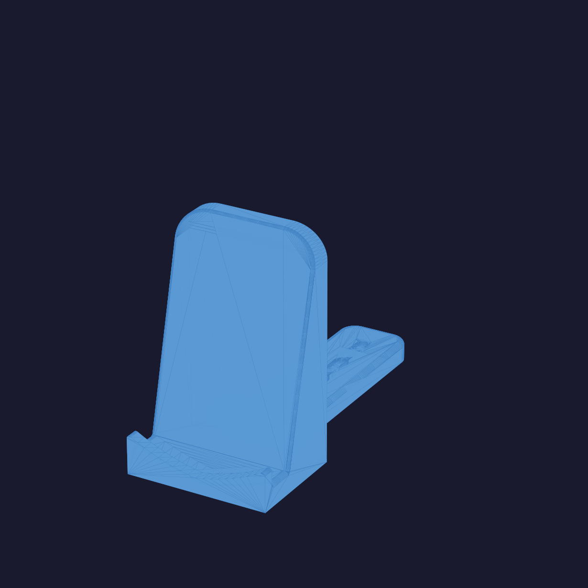

# Coin Stand

A 3D-printable stand for displaying mission coins.

<p align="center"></p>

[View interactive 3D model →](assembled/full.stl) Two versions are included: a single-piece assembled model and a two-part disassembled model that is easier to print without supports.

## Files

```
assembled/
  full.stl        — Complete stand in one piece

disassembled/
  base.stl        — Bottom base component
  stand.stl       — Upright stand component
```

## Which version should I print?

| Version | When to use |
|---|---|
| `assembled/full.stl` | Your printer handles overhangs well and you want a single print |
| `disassembled/` (both files) | Better surface quality; parts snap or glue together after printing |

## Printing Instructions

### Recommended settings

| Setting | Value |
|---|---|
| Material | PLA or PETG |
| Layer height | 0.2 mm |
| Infill | 15–20% |
| Supports | Not required (disassembled version) |
| Bed adhesion | Brim recommended |

### Steps

1. Open your slicer (e.g. PrusaSlicer, Bambu Studio, Cura).
2. Import the STL file(s) you want to print.
3. Orient the parts flat side down on the build plate.
4. Apply the settings above and slice.
5. Export the G-code and send it to your printer.
6. If printing the disassembled version, join `base.stl` and `stand.stl` after printing using a press fit or a small amount of super glue.

## License

See [LICENSE](LICENSE) if present, or contact the repository owner for usage terms.
